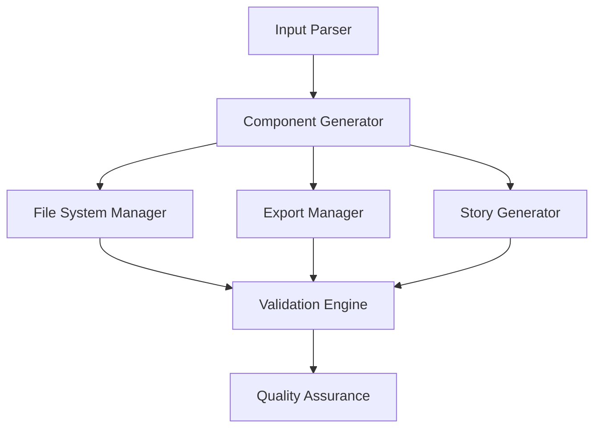

# Design Document

## Overview

The Tailwind UI Pattern Import System is designed as a code generation and organization tool that transforms Tailwind UI snippets into a structured component library. The system uses a parser-transformer-generator architecture to process input, maintain file organization, and ensure quality through validation.

## Architecture

### Core Components



### Data Flow

1. **Input Processing**: Parse section:variant format and extract Tailwind UI code
2. **Component Generation**: Transform code into TypeScript component with proper imports
3. **File Organization**: Create directory structure and place files
4. **Export Management**: Update barrel exports and top-level exports
5. **Story Creation**: Generate Storybook stories
6. **Validation**: Verify TypeScript compilation, imports, and linting

## Components and Interfaces

### CSV Parser

**Purpose**: Parse and validate CSV input files containing multiple component definitions

```typescript
interface ParsedComponent {
  section: string;
  variant: string;
  componentName: string;
  originalCode: string;
}

interface CSVParser {
  parseFile(filePath: string): ParsedComponent[];
  validateCSV(filePath: string): ValidationResult;
  validateRow(row: CSVRow): ValidationResult;
}

interface CSVRow {
  section: string;
  variant: string;
  code: string;
}
```

**Key Functions**:

- Parse CSV files with section, variant, and code columns
- Validate CSV format and required columns
- Generate PascalCase component names for each row
- Preserve original Tailwind UI code from each row
- Handle CSV parsing errors and malformed data

### Component Generator

**Purpose**: Transform Tailwind UI code into framework-agnostic TypeScript components

```typescript
interface ComponentGenerator {
  generateComponent(parsed: ParsedInput): GeneratedComponent;
  addJSDocHeader(component: string, metadata: ComponentMetadata): string;
  processImports(code: string): string;
  addClientDirective(code: string): string;
}

interface GeneratedComponent {
  code: string;
  imports: string[];
  hasState: boolean;
  metadata: ComponentMetadata;
}
```

**Key Functions**:

- Add JSDoc headers with required tags
- Process and standardize imports
- Detect state usage for 'use client' directive
- Maintain framework agnostic compatibility

### File System Manager

**Purpose**: Handle directory creation and file placement

```typescript
interface FileSystemManager {
  createDirectoryStructure(section: string): void;
  writeComponent(path: string, content: string): void;
  checkFileExists(path: string): boolean;
  generateVersionedName(baseName: string): string;
}
```

**Key Functions**:

- Create nested directory structure
- Handle file versioning (V2, V3, etc.)
- Ensure no overwrites of existing files
- Maintain consistent path structure

### Export Manager

**Purpose**: Manage barrel exports and top-level exports

```typescript
interface ExportManager {
  updateSectionBarrel(section: string, componentName: string): void;
  updateTopLevelExport(section: string): void;
  generateExportStatement(componentName: string): string;
}
```

**Key Functions**:

- Update section-level index.ts files
- Update top-level packages/ui/index.ts
- Generate proper export statements
- Maintain existing exports

### Story Generator

**Purpose**: Create Storybook stories for components

```typescript
interface StoryGenerator {
  generateStory(componentName: string, section: string): string;
  createStoryTemplate(metadata: ComponentMetadata): string;
}
```

**Key Functions**:

- Generate TypeScript story files
- Create proper import statements
- Set up Meta and StoryObj configuration
- Include default story implementation

### Pattern Registry Manager

**Purpose**: Maintain component metadata and organization

```typescript
interface PatternRegistry {
  updateRegistry(section: string, componentData: ComponentData): void;
  getExistingComponents(section: string): ComponentData[];
}

interface ComponentData {
  componentName: string;
  variant: string;
  source: string;
  path: string;
  framework: string;
}
```

## Data Models

### Component Metadata

```typescript
interface ComponentMetadata {
  pattern: string; // section name
  variant: string; // variant description
  component: string; // component name
  source: string; // "Tailwind UI"
  usage: string; // usage description
  framework: string; // "agnostic"
  dependencies: string[]; // required packages
}
```

### File Paths

```typescript
interface FilePaths {
  component: string; // packages/ui/components/patterns/{section}/{ComponentName}.tsx
  sectionBarrel: string; // packages/ui/components/patterns/{section}/index.ts
  topLevelExport: string; // packages/ui/index.ts
  story: string; // apps/web/stories/{ComponentName}.stories.tsx
  registry: string; // packages/ui/components/patterns/{section}/pattern.config.json
}
```

## Error Handling

### CSV Validation Errors

- **Invalid CSV Format**: Clear error messages with CSV structure examples
- **Missing Required Columns**: Specific guidance on required section, variant, code columns
- **Empty Code Cells**: Validation that Tailwind UI code is provided in each row
- **Malformed CSV Data**: Handle parsing errors and provide row-specific error messages

### File System Errors

- **Permission Issues**: Graceful handling with user guidance
- **Directory Creation Failures**: Fallback strategies and error reporting
- **File Write Conflicts**: Automatic versioning and user notification

### Code Generation Errors

- **Import Resolution**: Validation of required dependencies
- **TypeScript Compilation**: Syntax checking and error reporting
- **Framework Compatibility**: Detection of framework-specific code

### Validation Errors

- **Linting Failures**: Automatic formatting and style corrections
- **Storybook Integration**: Story loading and rendering validation
- **Export Chain**: Verification of complete import/export chain

## Testing Strategy

### Unit Testing

- **CSV Parser**: Test CSV parsing, validation, and error handling
- **Component Generator**: Verify code transformation and JSDoc generation
- **File System Manager**: Test directory creation and file operations
- **Export Manager**: Validate export statement generation

### Integration Testing

- **End-to-End Flow**: Complete import process from input to validation
- **File System Integration**: Verify actual file creation and organization
- **Storybook Integration**: Test story generation and loading
- **TypeScript Compilation**: Validate generated code compiles successfully

### Quality Assurance

- **Linting Validation**: Ensure all generated code passes linting
- **Framework Compatibility**: Test components in different React environments
- **Import Chain Validation**: Verify complete export/import functionality
- **Regression Testing**: Ensure new imports don't break existing components

## Implementation Considerations

### Performance

- **Batch Processing**: Handle multiple pattern imports efficiently
- **File System Optimization**: Minimize file I/O operations
- **Validation Caching**: Cache validation results for repeated operations

### Maintainability

- **Modular Design**: Clear separation of concerns between components
- **Configuration Driven**: Use configuration files for customizable behavior
- **Error Recovery**: Graceful handling of partial failures

### Extensibility

- **Plugin Architecture**: Support for custom transformations
- **Template System**: Configurable templates for different output formats
- **Framework Adapters**: Easy addition of framework-specific optimizations
