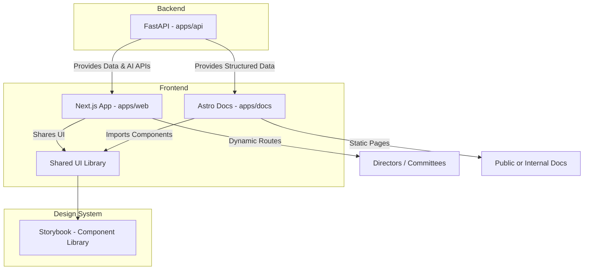

# salient-platform

Platform for making apps

## 🧭 Framework Decision Guide: When to Use Next.js vs Astro

This repository contains two coordinated front-end workspaces that share a single design system (`apps/web/src/components/ui`). Use the right one depending on the type of page or workflow you’re building.

---

### ⚙️ Next.js (`apps/web`)

Use this for anything interactive, dynamic, or behind login.

| Purpose              | Examples                                               | Notes                                    |
| -------------------- | ------------------------------------------------------ | ---------------------------------------- |
| Application UI       | Dashboards, admin panels, reports, user settings       | Use Server + Client components as needed |
| Data-driven pages    | Board briefing views, committee insights, live metrics | Fetch data from FastAPI or GCP endpoints |
| Authenticated routes | Director portal, committee workspaces                  | Integrate with NextAuth or custom JWT    |
| API integration      | Real-time updates, notifications, AI results           | Built for dynamic rendering and caching  |

🧩 Component imports:

```tsx
import { Button } from "@/components/ui/button";
```

---

### 📘 Astro + MDX (`apps/docs`)

Use this for content-first or marketing-style pages.

| Purpose                    | Examples                               | Notes                           |
| -------------------------- | -------------------------------------- | ------------------------------- |
| Documentation              | “How It Works”, “System Overview”      | Pure MDX or Markdown content    |
| Landing / Product pages    | Platform overview, feature highlights  | Statically generated for speed  |
| Case studies or blog posts | AI in Governance, Product Design Notes | Can embed live React components |
| Internal notes / handbooks | Service Playbooks, Style Guides        | Fast to edit, low maintenance   |

🧩 MDX Example:

```mdx
---
title: "Board Briefing Overview"
---

# How the Board Briefing Dashboard Works

Directors can stay informed between meetings.

<Button>Explore Dashboard</Button>
```

---

### 🧩 Shared Design System

All UI elements live under:

```
apps/web/src/components/ui/
```

You can import the same components into both Next.js and Astro:

- Next.js: via `@/components/ui/...`
- Astro: via `import { Button } from "web/src/components/ui/button"`

Storybook (`npm run storybook --workspace web`) documents these components with live previews and MDX stories.

---

### ✅ Quick Rules for Codex

| If you are building…                  | Use             | Output type       |
| ------------------------------------- | --------------- | ----------------- |
| A workflow, dashboard, or data view   | Next.js         | Dynamic app       |
| A marketing, info, or doc page        | Astro           | Static site       |
| Shared UI component or design element | Storybook (web) | Component preview |
| Backend logic or API                  | FastAPI (api)   | JSON API          |

---

### 🧠 Visual Architecture Diagram (Mermaid)



---

### 🪴 Summary

- Next.js: Dynamic interfaces and data workflows.
- Astro: Static or MDX-driven content with embedded React.
- Storybook: UI playground and documentation.
- FastAPI: Backend logic and data APIs.

Together, they form the Salient Platform Architecture, where each part is modular, replaceable, and shares a unified design system.

---

## 🛠️ Local Development Setup

### 🔐 Authentication Setup (WorkOS)

This template includes WorkOS authentication pre-configured. To set up:

1. **Run the environment setup script:**

   ```bash
   ./scripts/setup-env.sh
   ```

2. **Get your WorkOS credentials:**
   - Sign up at [WorkOS Dashboard](https://dashboard.workos.com/)
   - Create a new application
   - Copy your Client ID and API Key

3. **Configure your .env files:**

   ```bash
   # In apps/web/.env.local
   WORKOS_CLIENT_ID=your_actual_client_id
   WORKOS_API_KEY=your_actual_api_key
   WORKOS_REDIRECT_URI=http://localhost:3000/auth/callback
   ```

4. **Set up redirect URI in WorkOS dashboard:**
   - Add `http://localhost:3000/auth/callback` as a redirect URI
   - For production, add your production domain

### 🐍 Python Setup

Ensure Python 3.13 is available via `pyenv` (auto-activated thanks to `.python-version`).

```bash
pyenv install 3.13.0          # first-time only
pyenv local 3.13.0
python -m venv .venv
source .venv/bin/activate
pip install -r apps/api/requirements.txt
```

Add this to your `~/.zshrc` (or shell equivalent) so `pyenv` is always available:

```bash
export PYENV_ROOT="$HOME/.pyenv"
command -v pyenv >/dev/null || export PATH="$PYENV_ROOT/bin:$PATH"
eval "$(pyenv init -)"
eval "$(pyenv virtualenv-init -)"
```

Node workspaces use the root `package-lock.json`. Install dependencies once:

```bash
npm install
```

---

## ♻️ Automated Formatting & Linting

- **Python:** Install `pre-commit`, then enable the repo hooks.

  ```bash
  pip install pre-commit black isort
  pre-commit install
  ```

- **JavaScript/TypeScript:** Husky + lint-staged run ESLint/Prettier before every commit.

  ```bash
  npm run prepare
  npx husky install                     # if not already executed
  ```

  The Husky pre-commit hook executes `lint-staged`, which applies ESLint/Prettier fixes to staged files.

---

## 🧪 Tests

- **FastAPI** (from `apps/api`):

  ```bash
  pytest
  ```

- **Next.js** (from `apps/web`):

  ```bash
  npm run test -- --run
  ```

Add more suites with Vitest or Playwright as needed.

---

## 🐳 Docker Compose Orchestration

`docker-compose.yml` launches the full stack with live reload:

```bash
docker-compose up --build
```

Services exposed:

| Service | Port | Description                  |
| ------- | ---- | ---------------------------- |
| web     | 3000 | Next.js app (`apps/web`)     |
| docs    | 4321 | Astro docs (`apps/docs`)     |
| api     | 8080 | FastAPI backend (`apps/api`) |
| db      | 5432 | PostgreSQL 15                |
| redis   | 6379 | Optional caching/events      |

All services share the `salient-net` bridge network and use `.env` for environment variables.

---

## 🔄 Continuous Integration

`.github/workflows/build.yml` runs on every push/PR to `main`:

1. Checks out the monorepo.
2. Sets up Node 20 and Python 3.13 with dependency caching.
3. Installs workspace dependencies (`npm install`, `pip install -r apps/api/requirements.txt`).
4. Runs linting, Vitest unit tests, and `pytest`.
5. Builds the Next.js app, Astro docs, and Storybook bundle.

Use it as the baseline for any additional deployment workflows.
